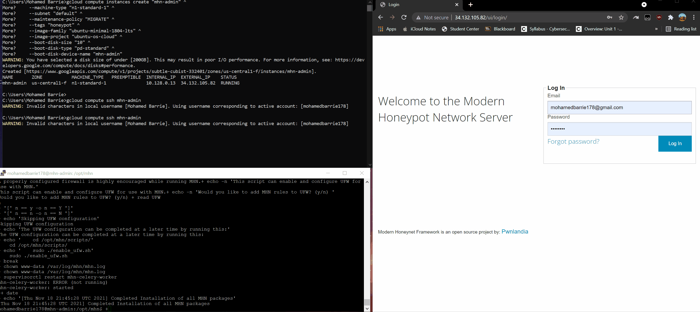

# Honeypot Assignment

**Time spent:** 10 hours spent in total

**Objective:** Create a honeynet using MHN-Admin. Present your findings as if you were requested to give a brief report of the current state of Internet security. Assume that your audience is a current employer who is questioning why the company should allocate anymore resources to the IT security team.

### MHN-Admin Deployment (Required)

**Summary:** How did you deploy it? Did you use GCP, AWS, Azure, Vagrant, VirtualBox, etc.?

A cloud hosting provider was first need to do the deployment. Google cloud was used and an SDK was installed. After the SDK was initialized, a VM was created and made accessible via SSH. A script later was installed on to the VM to load the external IP in the browser.

### Dionaea Honeypot Deployment (Required)

**Summary:** Briefly in your own words, what does dionaea do?

Dionaea is a honeypot that recieves lists of attacker and malware.

### Database Backup (Required) 

**Summary:** What is the RDBMS that MHN-Admin uses? What information does the exported JSON file record?

The database MHN-Admins use is JSON. The JSON file records the date of the attack, source ip of the attack, the source port, and identifier number.

*Be sure to upload session.json directly to this GitHub repo/branch in order to get full credit.*

## Notes

Describe any challenges encountered while doing the assignment.

I had issues with the instances and the ssh. Many times the connection timed out and I had to restart the assignment.
